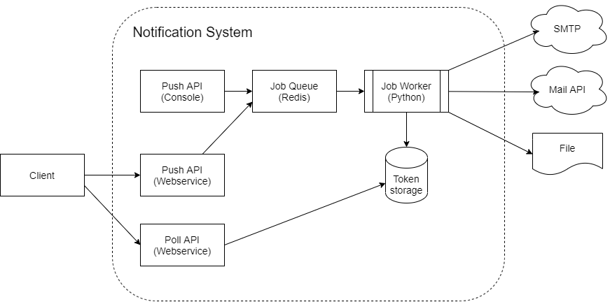

This is the Python project for send emails example that I've used Redis task queue on developing job queue.

# About Python RQ
> RQ (Redis Queue) is a simple Python library for queueing jobs and processing them in the background with workers. It is backed by Redis and it is designed to have a low barrier to entry. It can be integrated in your web stack easily.

# System overview


> For this phase requirements, I've implemented a console API to export files only.

# Performance test

Assume that we need to send 10k emails and some of them don't have email addresses. Each email needs 20ms to deliver.

This is the result on my PC using 6C12T CPU (~ 12 vCPU) 16 GB of RAM.

|# Workers|Push time|Total time|
|---:|---:|---:|
|1|19.31s|337.13s|
|2|21.39s|175.88s|
|4|26.92s|99.33s|
|8|44.11s|66.08s|

The result shows that the more worker we start, the less time we have to complete all tasks.

Push time seem to be increase because we're using the same server for both worker and push API

# Quick start

## Prerequisites
- Python 3
- Docker (for Redis task queue & worker deployment)

## Building and running worker
Build the worker
```
docker-compose build
```
Next, launch the worker and redis task queue
```
docker-compose up -d
```
Scale up more worker
```
docker-compose up -d --scale file_worker=XXX
```
## Building and running push API
Active Python virtual enviroment
```
python3 -m venv env
source env/bin/activate
```
Install dependencies
```
pip install -r requirements.txt
```
Launch program
```
python send_mail.py email_template.json customers.csv
```